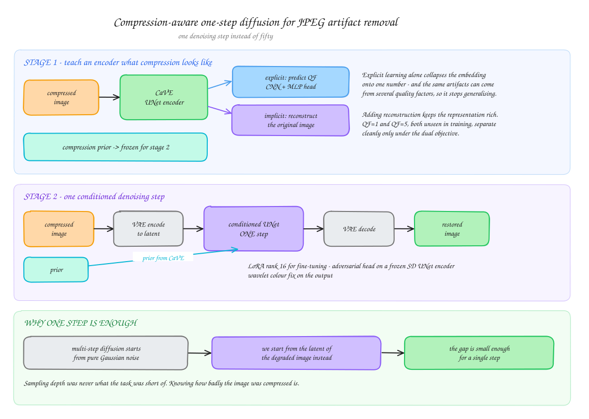
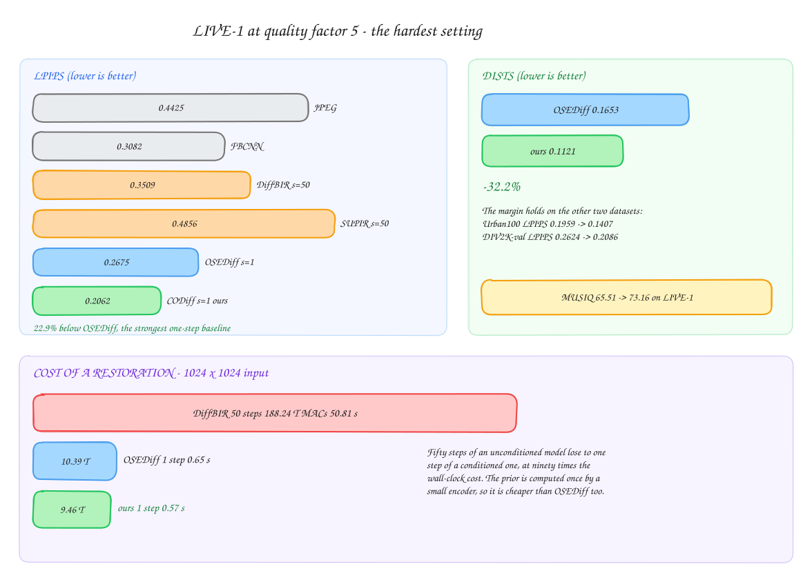

# Compression-Aware One-Step Diffusion for JPEG Artifact Removal

Implementation of [CODiff](https://arxiv.org/pdf/2502.09873) — a one-step diffusion model
that removes JPEG compression artifacts in a single denoising pass, conditioned on a
learned representation of *how* the image was compressed.

> Course project — CS 663: Digital Image Processing (Autumn 2025), IIT Bombay

---

## The problem

At low quality factors, JPEG destroys enough information that restoration stops being a
filtering problem and becomes a generative one. Blocking, colour banding and grid
distortion have to be replaced with plausible detail, not smoothed away.

Large text-to-image diffusion models carry exactly the prior this needs, and
diffusion-based restorers dominate at high compression. The catch is sampling cost: fifty
steps put DiffBIR at nearly a minute per image. One-step models fix the speed but throw
away something the task depends on — without knowing how heavily an image was compressed,
a restorer cannot tell a severe artifact from real texture, so it either under-corrects
clean regions or over-smooths detailed ones.

Feeding the quality factor as a single scalar is the obvious fix and a weak one. One
number is a poor description of a degradation whose appearance varies with content, and it
does not generalise to quality factors never seen in training.

---

## How it works

<p align="center">
  
</p>

<sub>Editable source: [`docs/pipeline.excalidraw`](docs/pipeline.excalidraw) — open at [excalidraw.com](https://excalidraw.com)</sub>

### Stage 1 — CaVE, the compression-aware visual embedder

A UNet encoder trained on two objectives at once:

- **Explicit** — a lightweight CNN + MLP head (512 hidden channels) regresses the quality
  factor from the latent summary, forcing the embedding to carry compression information.
- **Implicit** — the same embedder must support reconstruction of the original image.

The second objective is what makes the first usable. Trained on QF prediction alone, the
representation collapses onto a single number, and since identical artifact appearances can
arise from different quality factors, that supervision is ambiguous. Under the dual
objective, embeddings for QF=1 and QF=5 — both held out from training — separate cleanly;
under explicit learning alone they do not.

### Stage 2 — one conditioned denoising step

The compressed image is encoded to a latent, and a single denoising step conditioned on the
frozen CaVE priors produces the restored latent, which the VAE decodes. Multi-step
pipelines start from Gaussian noise; here the starting point is the degraded image itself,
so the distance to cover is small enough for one step.

Fine-tuning uses LoRA at rank 16. The adversarial component runs a discriminator built on a
pre-trained Stable Diffusion UNet encoder with a lightweight MLP head, and wavelet colour
correction fixes the colour shift latent-space restoration tends to introduce.

---

## Results

<p align="center">
  
</p>

### LIVE-1, QF = 5

| Method | Steps | LPIPS ↓ | DISTS ↓ | MUSIQ ↑ |
|---|---|---|---|---|
| JPEG | — | 0.4425 | 0.2637 | 42.71 |
| FBCNN | — | 0.3082 | 0.2325 | 57.75 |
| DiffBIR | 50 | 0.3509 | 0.2035 | 58.09 |
| SUPIR | 50 | 0.4856 | 0.2720 | 52.69 |
| OSEDiff | 1 | 0.2675 | 0.1653 | 65.51 |
| **Ours** | **1** | **0.2062** | **0.1121** | **73.16** |

**−22.9% LPIPS** and **−32.2% DISTS** against OSEDiff, the strongest one-step baseline.
The margin holds across datasets: Urban100 LPIPS 0.1959 → 0.1407, DIV2K-val 0.2624 →
0.2086.

### Cost per 1024×1024 restoration

| Method | Steps | MACs | Time |
|---|---|---|---|
| DiffBIR | 50 | 188.24 T | 50.81 s |
| OSEDiff | 1 | 10.39 T | 0.65 s |
| **Ours** | **1** | **9.46 T** | **0.57 s** |

Fifty steps of an unconditioned model lose to one step of a conditioned one, at ninety
times the wall-clock cost. Because the prior is produced once by a small encoder rather
than re-derived at every step, the model is marginally *cheaper* than OSEDiff despite
carrying an extra conditioning network.

Evaluation uses LPIPS and DISTS as full-reference perceptual metrics and MUSIQ, MANIQA and
CLIP-IQA as no-reference ones. Perceptual metrics are the right criterion here: generative
restoration at severe compression synthesises plausible detail rather than recovering the
exact original, so distortion metrics penalise the behaviour that makes an output look
correct.

---

## Repository layout

```
DiffusionJPEG/
├── cave.py                  # Compression-aware visual embedder
├── codiff.py                # One-step diffusion restoration model
├── unet_2d_condition.py     # Conditioned UNet backbone
├── autoencoder_kl.py        # Latent encoder / decoder
├── vaehook.py               # Tiled VAE for large inputs
├── attention.py             # Attention blocks
├── discriminator.py         # Adversarial head on a frozen SD UNet encoder
├── dataset_jpeg.py          # JPEG degradation pipeline and loaders
├── trainer.py               # Training loop
├── main_train_cave.py       # Stage 1 — CaVE
├── main_train_codiff.py     # Stage 2 — diffusion
├── main_test_codiff.py      # Evaluation / inference
├── wavelet_color_fix.py     # Colour-shift correction
├── cave.json                # Stage 1 config
├── codiff.json              # Stage 2 config
├── train_codiff.sh          # Stage 2 launcher
├── test_codiff.sh           # Inference launcher
├── docs/                    # README diagrams (.svg) + editable Excalidraw sources
└── environment.yml          # Conda environment
```

---

## Setup

```bash
conda env create -f environment.yml
conda activate codiff
```

Download `stable-diffusion-2-1-base` into `model_zoo/`. Set the dataset paths in
`cave.json` and `codiff.json` — both ship with `/PATH/TO/YOUR/DATASET` placeholders.

## Training

Stage 1, CaVE:

```bash
python main_train_cave.py --opt cave.json
```

Stage 2, the diffusion model, with CaVE frozen:

```bash
bash train_codiff.sh
```

The launcher runs `accelerate` across 8 GPUs at learning rate 5e-5, fp16 mixed precision,
LoRA rank 16, checkpointing every 3000 steps, with TensorBoard logging.

## Inference

```bash
bash test_codiff.sh
```

Point `-i` at a directory of compressed images and `-o` at the output directory;
`--cave_path` and `--codiff_path` take the two trained checkpoints.

---

## Limitations

- **Perceptual criterion.** Like other generative restorers, the model trades distortion
  metrics such as PSNR for perceptual fidelity. Applications needing pixel-exact
  reconstruction are out of scope.
- **JPEG only.** The compression prior is specific to JPEG; WebP, HEIF or video codecs
  would need the embedder retrained against those degradations.
- **QF = 1 remains hard.** At that level the information loss is severe enough that the
  output is largely synthesised.
- **Training cost.** Two-stage diffusion training is expensive, which bounds how many
  ablations fit in a course project.

---

## Reference

```bibtex
@article{codiff2025,
  title={Compression-Aware One-Step Diffusion Model for JPEG Artifact Removal},
  author={Guo, Jinpei and Chen, Xin and Zhang, Yong and others},
  journal={arXiv:2502.09873},
  year={2025}
}
```

Built on Stable Diffusion 2.1-base. Baseline numbers for DiffBIR, SUPIR, OSEDiff, FBCNN,
JDEC and PromptCIR follow the comparison protocol of the CODiff paper, where DiffBIR and
OSEDiff are retrained under matched settings.
